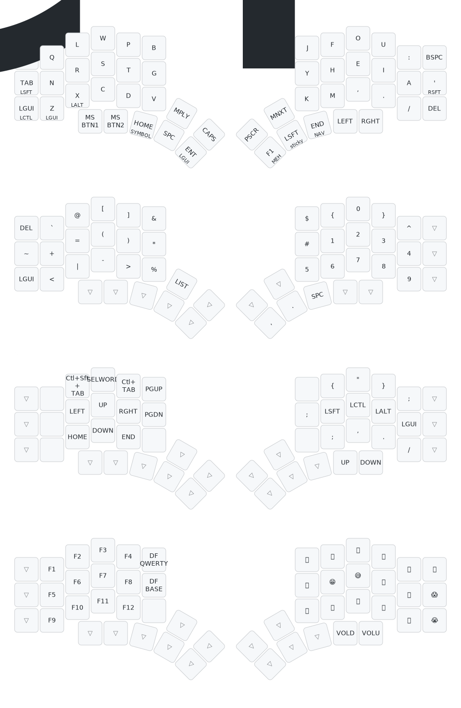

# My QMK keymap

This repository hosts my QMK keymap:

- [splitkb/kyria/rev3:stefsmeets](./keyboards/splitkb/kyria/keymaps/stefsmeets)
  - `qmk compile -kb splitkb/kyria/rev3/ -km stefsmeets`
- [splitkb/halcyon/corne/rev2:stefsmeets](./keyboards/splitkb/halcyon/corne/keymaps/stefsmeets)
  - `qmk compile -kb splitkb/halcyon/corne/rev2 -km stefsmeets`

## Layout

```
q l w p b  j f o u '
n r s t g  y h e i a
z x c d v  k m , . /

Sfb: 1.260%
Dsfb: 8.088%
Lsb: 1.600%

Inrolls: 21.721%
Outrolls: 24.815%
Total Rolls: 46.536%
Onehands: 1.600%

Alternates: 29.941%
Alternates (sfs): 8.641%
Total Alternates: 38.582%

Redirects: 4.101%
BadRedirects: 0.220%
Total Redirects: 4.321%

Other: 8.960%
Invalid: 0.001%
```

## Keymap drawing



## How to build locally

1. Run the normal `qmk setup` in the qmprocedure if you haven't already done so -- see [QMK Docs](https://docs.qmk.fm/#/newbs) for details.
    - Note: This command must be run in the `qmk_firmware` directory
1. Clone this repository
    - `git clone https://github.com/stefsmeets/qmk_keymaps`
1. Set global userspace path: 
    - `cd qmk_keymaps`
    - `qmk config user.overlay_dir="$(realpath .)"`
    - Note: you MUST be located in the cloned userspace location for this to work correctly
    - Note: This will be automatically detected if you've `cd`ed into your userspace repository, but the above makes your userspace available regardless of your shell location.
1. Compile normally: 
    - `qmk compile -kb splitkb/kyria/rev3 -km stefsmeets` or `make splitkb/kyria/rev3:stefsmeets`
    - Note: This command must be run in the `qmk_firmware` directory
